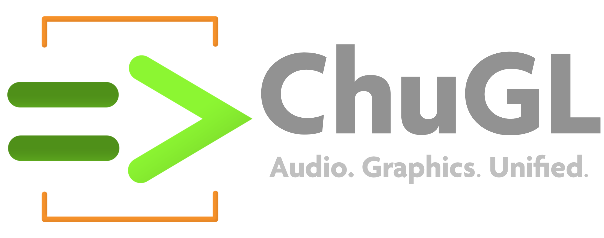

<div align="center">
<!-- Add ChuGL logo -->
<!--  -->



## ChuGL =&gt; ChucK Graphics Library

</div> <!-- end center -->

<p align="justify">
ChuGL (sounds like "chuckle"; rhymes with "juggle") is a unified audiovisual programming framework built into the <a target="_blank" href="https://chuck.stanford.edu/">ChucK programming language</a>. It combines ChucK's <b>strongly-timed, concurrent programming model</b> and <b>real-time audio synthesis</b> capabilities with a <b>hardware-accelerated 3D graphics engine and API</b>. At its core is a scenegraph architecture that provides <b>low-latency, high performance audiovisual synchronization at frame-level accuracy</b>.

ChuGL was created by <a href="https://ccrma.stanford.edu/~azaday/">Andrew Zhu Aday</a> and <a href="https://ccrma.stanford.edu/~ge/">Ge Wang</a>, with support from the <a  href="https://chuck.stanford.edu/doc/authors.html">ChucK Team</a>, and benefitted from prior prototypes of ChuGL and GLucK, respectively by Spencer Salazar and Philip Davidson.
</p>

___

**ChuGL v0.1.0** (alpha) — [**ChuGL API 
Reference**](https://chuck.stanford.edu/chugl/api/)
• [**ChuGL Examples**](https://chuck.stanford.edu/chugl/examples/)
• [**ChuGL Tutorial**](https://chuck.stanford.edu/chugl/doc/tutorial.html)

___

## Installing ChuGL
To install ChuGL as a pre-built chugin (ChuGL.chug), visit the [ChuGL homepage](https://chuck.stanford.edu/chugl/) for download and installation instructions.

## Building ChuGL
To build the latest ChuGL from source, clone the `chugl` repo from github:
```
git clone https://github.com/ccrma/chugl.git
```
Compatibility note: ChuGL requires ChucK 1.5.1.5 or higher. See the <a href="https://github.com/ccrma/chuck/">chuck</a> repo for more details regarding building ChucK.

### macOS
navigate to the `chugl/src` directory, and run `make mac`:
```
cd chugl/src
make mac
```
This should build a `ChuGL.chug` executable in `build-release`, which is also copied to the `chugl/src` directory. This file can be installed/used as any other chugin (e.g., install ChuGL.chug by copying it into `~/.chuck/lib`.)

### Windows
To build chuck using Visual Studio (2019 or later recommended), navigate to `chugl\src\`, and run `make build-release`:
```
cd chugl/src
make build-release
```
This creates a CMake compatible `build-release` directory with Visual Studio project files. Navigate into this directory and open `ChuGL.sln`. Building this project should create `ChuGL.chug`. This file can be installed/used as any other chugin (e.g., install ChuGL.chug by copying it into `C:\Users\<usename>\Documents\ChucK\chugins\`.)

### Linux
navigate to the `chugl/src` directory, and run `make linux`:
```
cd chugl/src
make linux
```
This should build a `ChuGL.chug` executable in `build-release`, which is also copied to the `chugl/src` directory. This file can be installed/used as any other chugin (e.g., install ChuGL.chug by copying it into `~/.chuck/lib`.)

If you are on a linux system, make sure to install the dependencies that GLFW require. By default, it tries to build for both X11 and Wayland so you need both sets of dependencies. If you only want to use/install one of them, turn either GLFW_BUILD_X11 or GLFW_BUILD_WAYLAND off when calling cmake, e.g.:

```shell
# Build with only X11 support
cmake -B build -DGLFW_BUILD_WAYLAND=OFF
```

## Running ChuGL

**Note:** Currently ChuGL only supports command-line chuck. MiniAudicle support to come soon. 

You can run commandline ChucK with the option `--chugin-probe` to check which chugins are found and properly loaded.

### Minimal Example

If the chugin is properly loaded, running the following example via commandline chuck will open a blank window. Press `esc` to exit. 

```cpp
while (true) { GG.nextFrame() => now; }
```

Congrats, you now have ChuGL properly installed!

## Learning Resouces

- [API Reference](https://chuck.stanford.edu/chugl/api/)
- [Examples](https://chuck.stanford.edu/chugl/examples/)
- [ChuGL Tutorial](https://chuck.stanford.edu/chugl/doc/tutorial.html)
